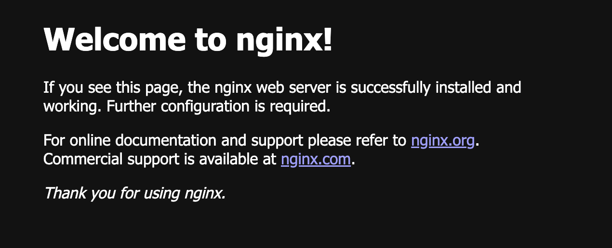
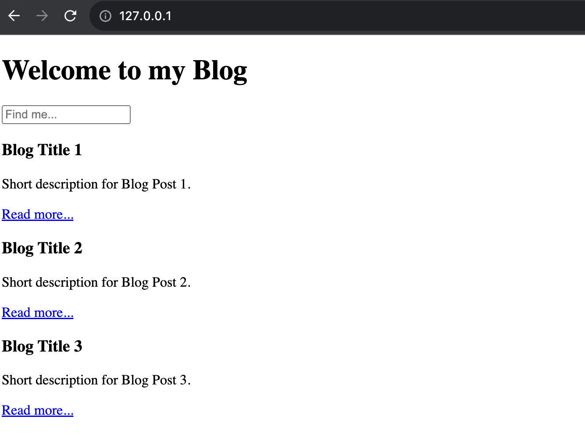

# Docker cơ bản

## Đặt vấn đề

* Bạn đã làm xong một cái web và muốn bàn giao cho khách hàng, lúc này bạn phải note lại tất cả các `lib` hay `dependencies` mà bạn đang sử dụng trong web của mình và phải cài đặt nó trên host một cách thủ công.
* Khách hàng không muốn sử dụng host của bạn nữa mà muốn tự quản lý website bạn đã làm trên host của họ luôn, mà server của họ lại sử dụng khác hệ điều hành với host của bạn.
* Bạn muốn tăng tải cho server bằng cách tăng server instance nhưng mất quá nhiều công sức để cài trên host hay vps của bạn và hơn nữa phải cấu hình thủ công quá nhiều bước.

Nếu như bạn đang tìm một giải pháp đơn giản hơn để đóng gói, deploy ứng dụng của bạn hay thậm chí là scale ứng dụng thì Docker sẽ là một trợ thủ đắc lực.

Bạn hãy tưởng tượng bạn đi mua một bàn phím cơ để code lên đồng hơn. Sau khi mua về, việc duy nhất bạn cần làm là kết nối bàn phím với laptop/pc rồi sau đó là enjoy. Rất nhanh gọn phải không nào!

<figure><figcaption><p>Bàn phím cơ thách thức mọi dòng code</p></figcaption></figure>

Quay về thế giới phần mềm, khi khách hàng nhận bàn giao ứng dụng từ bạn thì họ chỉ cần run `một câu lệnh duy nhất` là đã có thể sử dụng ngay. Nếu như bước bàn giao này đòi hỏi khách hàng phải config quá nhiều thì chắc hẳn bạn sẽ không thu hút được nhiều khách hàng sử dụng sản phẩm và dịch vụ của bạn đâu.

## Docker là gì?

<figure><figcaption><p>Docker là gì?</p></figcaption></figure>

Đối với mình, **Docker** chỉ đơn giản là một công cụ giúp chúng ta đóng gói phần mềm mà trong đó các `dependencies` của phần mềm luôn `consistent (đồng nhất)` ở mọi môi trường. **Docker** giúp tiết kiệm công sức trong việc triển khai ứng dụng phần mềm.

Nói đơn giản là thế, để sử dụng được **Docker** thì chúng ta phải **thấm nhuần** những `khái niệm` cũng như `cơ chế hoạt động` của nó và đây là những kiến thức mà chúng ta cần nắm khi làm việc với **Docker**:

* Docker Engine
* Docker Image
* Docker Container
* Networking
* Volume

Mình nghĩ nhiêu đây là đã đủ để bắt đầu. Mình sẽ đi qua những khái niệm trên và kèm theo những ví dụ nhỏ để bạn dễ hình dung hơn.

## Những thành phần cơ bản trong Docker

### Docker Engine

**Docker Engine** là thành phần CỐT LÕI của Docker, giống như Web Server là thành phần cốt lõi của Website hay CPU là thành phần cốt lõi của tất cả máy tính trên thế giới.

**Docker Engine** Gồm 2 thành phần chính:

* Daemon
* CLI

Từ khóa `Daemon` có lẽ sẽ mới với những bạn chưa từng đọc về khái niệm này.

Chúng ta hay mở `Process Manager` trong Windows hoặc `Activity Monitor` trong MacOS để theo dõi các Process đang hoạt động trên máy tính cá nhân của chúng ta. Trong danh sách những Process đang hoạt động đó thì có những Process đang chạy ngầm. Những Process chạy ngầm này gọi là `Daemon` và để tương tác với những Process này thì chúng ta phải thông qua `Docker CLI`.

Cuối cùng, **Docker Daemon** là một process chạy ngầm của Docker trong hệ điều hành với chức năng quản lý tất cả hoạt động của Docker. **Docker CLI** là những tập lệnh chạy thông qua của sổ Command Line để tương tác với **Docker Daemon**.

### Docker Image

Giả sử bạn build một RESTful API sử dụng NodeJS và bạn thường chạy câu lệnh `npm start` để chạy ứng dụng. thì cái cục RESTful API (bao gồm luôn câu lệnh `npm start`) chính là `images`. `Docker Image` được hiểu như là một application bao gồm source code, step để build, step để install dependencies và step để run.

**Một vài câu lệnh sử dụng trong bài thực hành**

| Mô tả                               | Câu lệnh                                     |
| ----------------------------------- | -------------------------------------------- |
| Download Docker Image từ Docker hub | `docker pull <image name>`                   |
| Liệt kê tất cả image đã download    | `docker image ls`                            |
| Xóa Docker Image đã download        | `docker image rm <image name hoặc image id>` |

### Docker Container

Khi run một ứng dụng thì chúng ta cần phải biết là ứng dụng đó được run môi trường hay hệ điều hành nào? Thì **Docker Container** chính là cái môi trường hay cái hệ điều hành CHỨA source code, step để build, step để install dependencies và step để run, hay gọi một cách khác là CHỨA **Docker Image**.

**Một vài câu lệnh sử dụng trong bài thực hành**

| Mô tả                                                      | Câu lệnh                                                            |
| ---------------------------------------------------------- | ------------------------------------------------------------------- |
| Tạo mới container                                          | `docker container run <image name>`                                 |
| Liệt kê tất cả container đã tạo                            | `docker container ls`                                               |
| Stop một running container                                 | `docker container stop <container name hoặc container id>`          |
| Start một inactive container                               | `docker container start <container name hoặc container id>`         |
| Xóa Docker Container                                       | `docker container rm <container name hoặc container id>`            |
| Tương tác trực tiếp với container thông qua `bash` program | `docker container exec -it <container name hoặc container id> bash` |

***

OK, bây giờ thực hành một chút để **feel** hơn nhé.

## Hands on time

Các bài thực hành dưới đây chủ yếu làm rõ hơn về cách Docker hoạt động. Vì thế, bước cài đặt Docker mình sẽ bỏ qua. Nếu bạn chưa cài đặt Docker thì có thể theo hướng dẫn tại [https://docs.docker.com/engine/install](https://docs.docker.com/engine/install/) và thực hiện theo hướng dẫn (tùy theo hệ điều hành mà bạn đang sử dụng).

### Bài 1 - Cài đặt \`nginx\` server bằng Docker

**Download `nginx` Image từ Docker Hub**

Mình có đề cập tới **Docker Hub** ở đây, nó chỉ đơn giản giống **Github**. Github chứa source-code của ứng dụng còn Docker Hub thì chứa image. That's it.

Và đây là link trỏ tới Image của `nginx`: https://hub.docker.com/\_/nginx

Chúng ta thường download source code từ Github thông qua câu lệnh `github clone <link tới repository>`, thì download image từ Docker Hub cũng tương tự thông qua câu lệnh `docker pull <image name>`.

Bây giờ chúng ta sẽ download `nginx` image này từ Docker Hub bằng câu lệnh

```bash
docker pull nginx
```

Và đây là kết quả sau khi chạy câu lệnh trên

```bash
Using default tag: latest
latest: Pulling from library/nginx
90524f7dc01b: Already exists
14cea127239b: Pull complete
8a2be7a4590d: Pull complete
9dc7844e6774: Pull complete
a274c3e9974e: Pull complete
b24de7c2768b: Pull complete
49c25f2442ea: Pull complete
Digest: sha256:67f9a4f10d147a6e04629340e6493c9703300ca23a2f7f3aa56fe615d75d31ca
Status: Downloaded newer image for nginx:latest
docker.io/library/nginx:latest
```

Chúng ta vừa download thành công `nginx` image. Để liệt kê tất cả image đã được download từ Docker Hub, chúng ta dùng câu lệnh sau

```bash
docker image ls
```


**Cấu trúc lệnh trong Docker CLI**

Những câu lệnh trong Docker CLI tuân theo cú pháp như sau


```bash
docker <command> <sub_command>
```


**Ví dụ**:

* Bạn đang thao tác với image module thì command sẽ là `docker image <sub_command>.`
* Giả sử bạn muốn liệt kê tất cả images đã download thì sử dụng `docker image ls`
* Ngoài ra, để biết trong module `image` có bao nhiêu `<sub_command>` thì bạn có thể dùng câu lệnh sau để xem cách sử dụng của từng `<sub_command>`

```bash
docker <command> --help
docker image --help #Xem sub_command trong image module
docker container --help #Xem sub_command trong container module 
```


**Run `nginx` image trong Docker Container**

Để tạo mới một container, chúng ta sử dụng sub command `run` trong `container` module để tạo và run một container hoàn toàn mới. Syntax như sau

```bash
docker run <image name>
```

Sau đây là câu lệnh để tạo mới và run container cho `nginx` image

```bash
docker run --name web-server --detach --publish 8080:80 nginx
```

Sau khi câu lệnh trên được execute thì docker sẽ làm 3 việc chính như sau:

* Kiểm tra xem image `nginx` đã tồn tại ở local chưa? Nếu đã tồn tại rồi thì thôi, ngược lại thì sẽ download mới về.
* Tạo container để chứa `nginx` image.
* Kích hoạt startup command từ `nginx` image để start nginx server.

**Giải thích một vài options trong câu lệnh trên**

* `--name`: option để đặt tên cho container. Container này sau khi được tạo có tên là `web-server`.
* `--detach`: option này có nghĩa là, khi container này sẽ được tạo và chạy ngầm, nghĩa là bạn chỉ thấy mỗi container id được trả về từ command line response ngoài ra không thấy bất kỳ thông tin logs nào từ nginx. Cách viết tắt cho option này là `-d`
* `--publish`: option này dùng để map port từ docker container ra môi trường local của chúng ta theo format `<port publish từ machine của bạn>:<port publish từ docker container>`. Ví dụ: container của bạn start RESTful API server trên port `3000`, bạn muốn users gọi vào endpoint thông qua port `8443` thì có thể map port như sau `8443:3000`. Trong ví dụ trên nginx sẽ start server ở port `8080` và bạn muốn publish port `80` từ máy bạn ra internet thì bạn sẽ dùng format `80:80`.

Cuối cùng, chúng ta cũng đã tạo xong container để chạy `nginx` để làm web server. Bây giờ, bạn thử truy cập bằng url http://127.0.0.1:8080 để kiểm tra xem trang chủ của nginx server đã xuất hiện chưa nhé

<figure><figcaption><p>Trang chủ nginx</p></figcaption></figure>

Tada! OK bài thực hành 1 đã xong.

### Bài 2 - Deploy một static web server trên \`nginx\`

Trong bài thực hành này chúng ta sẽ làm những việc sau

* Stop `nginx` container ở bài thực hành #1.
* Remove `nginx` container ở bài thực hành #1.
* Xóa `nginx` image đã download ở bài thực hành #1.
* Deploy một static web server (`nginx`) với file `index.html` bên dưới, publish port `80`.
* Khi truy cập vào url: http://127.0.0.1 thì sẽ xuất hiện trang web với nội dung như sau

Đây là nội dung file `index.html`.


```html
<!DOCTYPE html>
<html lang="en">

<head>
  <meta charset="UTF-8">
  <meta name="viewport" content="width=device-width, initial-scale=1.0">
  <title>My Blog</title>
  <style>
    /* Add your custom CSS styles here (if needed) */
  </style>
</head>

<body>
  <h1>Welcome to my Blog</h1>
  <input type="text" placeholder="Find me...">
  <!-- Card 1 -->
  <div class="card">
    <h3>Blog Title 1</h3>
    <p>Short description for Blog Post 1.</p>
    <a href="#">Read more...</a>
  </div>
  <!-- Card 2 -->
  <div class="card">
    <h3>Blog Title 2</h3>
    <p>Short description for Blog Post 2.</p>
    <a href="#">Read more...</a>
  </div>
  <!-- Card 3 -->
  <div class="card">
    <h3>Blog Title 3</h3>
    <p>Short description for Blog Post 3.</p>
    <a href="#">Read more...</a>
  </div>
</body>
</html>
```


Bây giờ chúng ta cùng nhau bắt tay vào làm.

**Stop `nginx` container ở bài thực hành #1.**&#x20;

Để stop một running container chúng ta dùng sub command `stop` trong container module

```bash
docker container stop <container name hoặc container id>
```

Do ở bài thực hành #1 chúng ta đã đặt tên cho nginx container là `web-server` nên câu lệnh để stop container

```bash
docker container stop web-server
```


**Cách tìm container id**

Để tìm container id của `web-server` container chúng ta có thể dùng sub command `ls` để liệt kê tất cả container trong docker engine.

```bash
docker container ls
```

Docker sẽ trả về cho ta danh sách những container, dùng mắt thường để soi từng cấu hình như: Name, port, image theo từng row để xác container mà ta muốn tìm.

Ngoài ra, còn một cách filter hay hơn, với câu lệnh bên dưới nó sẽ trả về những container khớp với filter của chúng ta.

```bash
docker container ls --filter name=web-server
```


**Remove `nginx` container ở bài thực hành #1.**&#x20;

Để remove container thì cũng tương tự stop container. Chúng ta sub command `rm`.

```bash
docker container rm <container name hoặc container id>
```

Câu lệnh remove container sẽ như sau

```bash
docker container rm web-server
```

**Remove `nginx` image ở bài thực hành #1.**&#x20;

Để remove image thì chúng ta dùng sub command `rm` từ `image` module.

```bash
docker image rm <image name hoặc image id>
```

Câu lệnh sẽ như sau

```bash
docker image rm nginx
```

<mark style="color:yellow;">Note: Câu lệnh trên chỉ có thể xóa image khi tất cả container đang sử dụng image đó đang không ở trạng thái running.</mark>


Force xóa image

Muốn xóa một image mà container vẫn đang hoạt động thì chúng ta có thể thêm options `-f` hay `--force`. Câu lệnh sẽ như sau

```bash
docker image rm nginx -f
```

Tuy nhiên, dùng cách này không được khuyến khích.


XONG, mọi thứ đã sạch sẽ và hợp vệ sinh. Bây giờ, chúng ta tiếp tục deploy một static web server mới hoàn toàn với nội dung từ file `index.html` có sẵn

**Deploy một static web server (`nginx`) với file `index.html` có sẵn**

* Tạo container từ `nginx` với published port `80:80`

```bash
docker container run -dp 80:80 --name blog-web-server nginx
```


options `-dp` là một cách viết tắt cho `-d -p` (`--detach --publish`).


Ở bài thưc hành #1, chúng ta phải thực hiện download image rồi với tạo container. Còn ở bài thực hành #2 này, chúng ta chạy trực tiếp lệnh tạo container. Lúc này, Docker sẽ tự động download image nếu không tìm thấy trong local machine. Vì thế, bước download image không cần thiết nữa

Bây giờ chúng ta truy cập vào `http://127.0.0.1` sẽ thấy trang chủ của `nginx` xuất hiện. Tuy nhiên, chúng ta chưa dừng lại ở đây, mong đợi là phải xuất hiện trang `index.html` trong đề bài. Vì vậy, chúng ta cần truy cập vào bên trong container để tạo file `index.html`

**Tạo file `index.html`**

Hãy tạo file `index.html` với nội dung và lưu tại nơi bạn đang gọi `docker` command

```html
// index.html
<!DOCTYPE html>
<html lang="en">

<head>
  <meta charset="UTF-8">
  <meta name="viewport" content="width=device-width, initial-scale=1.0">
  <title>My Blog</title>
  <style>
    /* Add your custom CSS styles here (if needed) */
  </style>
</head>

<body>
  <h1>Welcome to my Blog</h1>
  <input type="text" placeholder="Find me...">
  <!-- Card 1 -->
  <div class="card">
    <h3>Blog Title 1</h3>
    <p>Short description for Blog Post 1.</p>
    <a href="#">Read more...</a>
  </div>
  <!-- Card 2 -->
  <div class="card">
    <h3>Blog Title 2</h3>
    <p>Short description for Blog Post 2.</p>
    <a href="#">Read more...</a>
  </div>
  <!-- Card 3 -->
  <div class="card">
    <h3>Blog Title 3</h3>
    <p>Short description for Blog Post 3.</p>
    <a href="#">Read more...</a>
  </div>
</body>
</html>
```

* Copy file `index.html` vào default html document root path của nginx `/usr/share/nginx/html`.&#x20;

Để làm được điều này, chúng ta sử dụng câu lệnh

```bash
docker cp <source_path> <container name hoặc container id>:<destination_path>
```

Câu lệnh copy file `index.html` từ local machine sang container như sau

```bash
docker cp index.html blog-web-server:/usr/share/nginx/html/index.html
```

Để kiểm tra `index.html` của chúng ta có thực sự đã được copy vào container hay không? Chúng ta truy cập vào container sub command `exec` trong `container` module với syntax như sau

<pre class="language-bash"><code class="lang-bash"><strong>docker container exec -it &#x3C;container name hoặc container id> bash
</strong></code></pre>

**Trong đó:**

* `-it`: option viết tắt của `--interactive --tty`. `--interactive` option cho phép ta tương tác trực tiếp với container, `--tty` option sẽ giả lập một trình soạn thảo TTY.
* `bash`: chính là `bash` program trong Linux. Vì mặc định docker sẽ chạy trong môi trường Linux

Câu lệnh sẽ như sau

```bash
docker container exec -it blog-web-server bash
```

Lúc này, một interactive termal sẽ xuất hiện. Chúng ta kiểm tra thử nội dung file `index.html` đã đúng hay chưa?

```bash
cat /usr/share/nginx/html/index.html
```

OK, mọi thứ đã được cài đặt xong. Bây giờ chúng ta thử vào url http://127.0.0.1 để xem thành quả.

<figure><figcaption><p>Blog list page</p></figcaption></figure>

Cuối cùng, bài thực hành #2 cũng kết thúc.

## Tạm kết

Thông qua bài viết này, chúng ta đã đi qua một vài kiến thức cơ bản như sau:

* Hiểu về Docker Engine bao gồm 2 thành phần cơ bản là Docker Daemon và Docker CLI. Docker Daemon là một process ngầm chạy trong hệ điều hành của máy tính. Để tương tác với Docker Daemon chúng ta dùng Docker CLI.
* Image được xem là một application bao gồm tất tần tật mọi thứ từ source code, dependencies đến startup command.
* Container là nơi vận hành Image (application) của chúng ta.

Thông qua 2 bài thực hành nhỏ, chúng ta cũng đã nắm cơ bản cách sử dụng Docker Image và Docker Container.

Hẹn gặp các bạn trong bài viết tiếp theo cùng những ví dụ liên quan đến `data` và `networking`.
