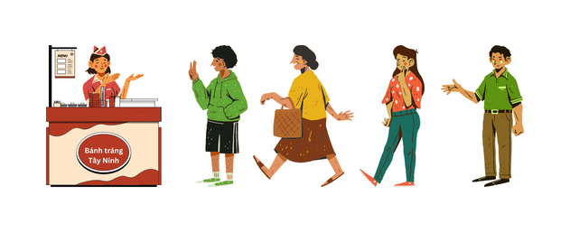

# Message Queue từ xe bánh tráng trộn

## Lời mở đầu

RabbitMQ là một Message Broker, đã và đang được sử dụng rất rộng rãi trên toàn cầu. Ai cũng biết RabbitMQ hoạt động dựa trên 2 trường phái chính **Asynchronous & Message Driven Programing**. Trong bài viết này, chúng ta khoan vội tìm hiểu về RabbitMQ mà thay vào đó chúng ta sẽ tìm hiểu về những điều cơ bản nhất của Message Broker.

* Nó là gì?
* Nó được tạo ra như thế nào?
* vận hành ra sao?

Đây sẽ là kiến thức chúng ta sẽ cùng nhau điểm lại một cách tuần tự.

1. Synchronous Programing
2. Asynchronous Programing
3. Message Driven Programing
4. Message Broker

Tôi xin phép mượn một sự kiện người thật việc thật. Đó là khi mẹ tôi khởi nghiệp quán bánh tráng trộn đầu tiên để mô tả những điều bên trên.

## Những ngày khởi nghiệp đầu tiên của mẹ tôi

> Cách đây 15 năm, cả gia đình tôi di cư lên mảnh đất Sài Thành đất chật người đông để tìm kế sinh nhai. Mẹ tôi đã thử qua rất nhiều loại hình công việc khác nhau nhưng không mấy khả quan. Sau nhiều đêm suy nghĩ thì mẹ tôi quyết định làm một quầy bán Bánh Tráng Trộn cho các em học sinh và mấy bạn trẻ trong xóm. Không ngoài dự đoán, xe bánh tráng trộn đơn giản này lại là cần cầu cơm rất hiệu quả của mẹ tôi. Ngày qua ngày, xe bánh tráng trộn ngày một đông khách, có hôm có tận 20 khách hàng đang xếp thành một hàng dài đợi mua bánh và mẹ tôi không thể làm xuể.

<figure><figcaption><p>Xe bánh tráng lúc mới khởi nghiệp</p></figcaption></figure>

### Synchronous Programming

Nếu thử ráp hoàn cảnh này vào Programing thì như thế nào? Nếu vận hành theo mô hình Client-Server thì **20 khách hàng** kia là **Client** và **mẹ tôi** là **Server** thì quy trình sẽ trông như sau:

<figure><figcaption><p>Quy trình làm bánh</p></figcaption></figure>

#### Cơ chế hoạt động của Synchronous Programming

**Synchronous Programing** xử lý quy trình theo tuần tự, công việc A hoàn tất thì công việc B mới bắt đầu.

> Xe bánh tráng của mẹ tôi cũng đã tròn 1 năm tuổi. Suốt một năm ấy, số lượng khách mua ngày càng đông lên và mẹ tôi phát hiện ra một điều "**Số lượng order tăng lên thì làm bánh lâu hơn**"
>
> * Khách hàng đợi quá lâu để tới lượt mình.
> * Nhiều lúc có khách order số lượng lớn, mẹ tôi đã huy động cả gia đình vào làm phụ nhưng vẫn không thể cải thiện tình hình.

Những vấn đề trên chính là vấn đề của mô hình **Client**–**Server** theo trường phái **Synchronous Programing**.


**Hạn chế của Synchronous Programming**

Nếu xét trong môi trường bao gồm **Client-Server** giao tiếp với nhau. Client lúc nào cũng phải chờ Server phản hồi thì mới xử lý tiếp được (cơ chế này gọi là **IO BLOCKING**). Nếu Server gặp sự cố thì request của Client coi như bị kẹt, có khi không nhận được kết quả từ phía Server.



Lợi ích của Synchronous Programing

Khi chúng ta cần xử lý một quy trình nào đó cần sự nhất quán thì Synchronous Programing là sự lựa chọn vừa đơn giản, vừa tiết kiệm và vừa hiệu quả.

Xử lý các process cần **Transaction Consistency** là một ví dụ điển hình, khi có lỗi xảy ra ở bất kỳ đâu trong quy trình thì tất cả cập nhật trước đó phải được `rollback`


## Nâng cấp quy trình kinh doanh

> Quay lại quầy bánh tráng trộn của mẹ tôi. Nhiều đêm trăn trở và bàn bạc với gia đình thì mẹ tôi quyết định nhận order thông qua điện thoại, để tránh việc khách hàng đứng đợi tại quầy quá lâu, làm cho trải nghiệm của khách hàng đối với quầy bánh tráng bị sa sút. Ngày hôm sau, khi có khách đến mua bánh thì mẹ tôi gửi số điện thoại để order. Khi khách hàng có nhu cầu mua bánh thì chỉ cần gọi đặt trước, khỏi phải đứng đợi tại quầy. Quy trình đơn giản thay đổi như sau

<figure><figcaption><p>Order qua điện thoại</p></figcaption></figure>

Và giải pháp này đã phát huy tác dụng của nó. Khách hàng không cần phải xếp thành một hàng dài để nhận bánh nữa và thậm chí số lượng đơn đặt hàng trong ngày đã tăng nhiều hơn so với trước.

### Asynchronous Programming

Nếu thử ráp giải pháp này vào Programming thì sẽ ra sao? Quy trình sẽ thay đổi như diagram bên dưới

Đây cũng là mô hình Client-Server nhưng theo một cách thức hoàn toàn khác **Asynchronous Programing**.

Mẹ tôi vẫn tiếp tục chuẩn bị bánh tráng để bán, nhưng bên cạnh đó có thể nhận order của khách hàng khác lúc rảnh tay, không nhất thiết phải đợi cho xong giao dịch mới nhận order của khách hàng khác. Và đó cũng chính là lợi ích mà **Asynchronous Programing** mang đến đó là “**NON IO BLOCKING**“

#### Cơ chế hoạt động của Asynchronous Programming

**Asynchronous Programming** cũng xử lý quy trình theo tuần tự. Tuy nhiên, điểm khác biệt so với Synchronous Programming là nó không bị block ở từng bước trong quy trình.

Như trong ví dụ của Synchronous phía trên, mẹ tôi nhận order xong thì phải làm bánh và giao cho khách ngay. Trong khi theo Asynchronous thì mẹ tôi không nhất thiết phải làm bánh ngay khi nhận order mà có thể nhận nhiều order cùng lúc rồi sau đó làm bánh giao luôn một lần để tiết kiệm thời gian.


**Lợi ích của Asynchronous Programming**

Client không cần phải chờ phản hồi từ Server. Chính cơ chế “Non IO Blocking” giúp cho Server linh hoạt hơn trong vấn đề xử lý request của Client.


## Tối ưu hóa quy trình

Lại bàn về công việc kinh doanh của mẹ tôi.

> Sau 2 năm kinh doanh, số lượng đơn đặt hàng trong ngày tăng cao hơn trước (khoàng 200 orders/giờ) và mẹ tôi nhận thấy không đủ khả năng để xử lý số lượng đơn đặt hàng. Mẹ về nhà với gương mặt mệt mỏi. Tuy vui nhưng cũng rất nhiều nỗi lo và gia đình là chỗ dựa cho những tình huống như thế này. Sau một hồi lâu bàn bạc thì Ba tôi nảy ra một ý tưởng như thế này.
>
> * Mở thêm một xe bánh tráng nữa đặt ở kế bên quầy chính, tạm gọi là quầy #1, quầy #2. Sau đó, thuê thêm 2 bạn sinh viên luân phiên theo ca để chuẩn bị bánh cho khách hàng.
> * Tôi chịu trách nhiệm nhận order, phân chia order cho quầy #1 và quầy #2. Bên cạnh đó, tôi cũng là người giao bánh và nhận tiền của khách hàng.
>
> Mô hình hoạt động mới của mẹ tôi chính thức triển khai vào ngày hôm sau. Lúc này, Khách hàng không còn liên hệ trực tiếp với mẹ tôi nữa, mà tôi sẽ là người trực điện thoại để nhận order và điều phối order cho 2 quầy bánh tráng của mẹ tôi.

<figure><figcaption></figcaption></figure>

Giải pháp mới đã giảm thiểu rất nhiều công sức vận hành và tình hình kinh doanh ngày càng phát đạt hơn nữa. Quy trình cơ bản như sau

1. Khách hàng đặt hàng thông qua gọi điện hoặc SMS
2. Tôi nhận order.
3. Tôi gửi order 2 quầy bánh. Quầy nào đang rảnh thì tôi gửi order cho quầy đó. Trường hợp cả 2 quầy đang bận thì tôi giữ order và gửi order sau khi thấy có quầy đang rảnh tay.
4. Tôi nhận bánh tráng từ 2 quầy bánh
5. Tôi giao bánh cho khách hàng
6. Khách hàng trả tiền và nhận bánh
7. Kết thúc giao dịch.

Như bạn cũng đã thấy, mẹ tôi bây giờ không còn giao tiếp trực tiếp với khách hàng nữa, bây giờ tất cả mọi order đều được gửi đến tôi.

### Message Driven Programming và Message Broker

Nếu ráp quy trình trên vào Programing thì sẽ trông như thế này

<figure><figcaption></figcaption></figure>

* **Order** lúc này được xem là **Message**
* **Quầy #1** và **Quầy #2** được gọi là **Service 1** và **Service 2**,
* Còn việc q**uản lý và điều phối Order hay Message** cho từng Quầy #1, Quầy #2 gọi là **Message Driven**.
* Còn tôi đại diện cho những **hệ thống bên thứ 3 để quản lý Message**, hay còn được gọi với cái tên chuyên ngành là **Message Broker**.

### Cơ chế hoạt động của Message Driven Programming

**Message Driven Programming**, khi gọi tới chữ Message Driven có nghĩa là trong mô hình này chỉ thao tác trên **Message**, tức **Message** là xương sống của mô hình này. Cơ chế hoạt động của **Message Driven Programming** khá dễ hiểu. Đây là một vài thành phần cơ bản trong mô hình này

* Người gửi message (Producer hoặc Publisher)
* Người nhận messsage (Consumer hoặc Subcriber)
* Message (thành phần quan trọng nhất)

> * Tôi dùng từ `Người` để mô tả cho dễ hình dung, nó có thể là bất cứ thực thể nào.
> * `Producer` hay được gán với `Consumer` và `Publisher` được gán với `Subcriber` thành một cặp về mặt khái niệm.

Tuy nhiên, để cho mô hình này rõ ràng và hiệu quả người, người ta thêm vào đó một thành phần rất quan trọng đó là **Message Broker** - người điều phối message giữa các thành phần. Message Broker trong đời sống thường ngày có thể kể đến: Bưu điện, Giaohangnhanh, Giaohangtietkiem, grab....

Để tôi mô tả bằng code typescript cho dễ hình dung hơn về cơ chế hoạt động


```typescript
interface OrderMessage {
  orderId: string;
  customerName: string;
  quantity: number;
  product: string;
  total: string;
}
```



```typescript
class Component {
  isDone = false;

  handleMessage(order: Message) {
    // Nếu là QUẦY BÁNH TRÁNG
    //    Nhận order tư Order manager
    //    Làm bánh tráng
    // Nếu là KHÁCH HÀNG
    //    Đặt hàng
    // Nếu là ORDER MANAGER
    //    Xử lý order của khách hàng

    this.isDone = true;
  }

  sendMessage(order: Message, recipient: Component) {
    // Gửi bánh tráng đã làm xong cho Order manager
    recipient.handleMessage(message);
  }
}
```



```typescript
const quayBanhTrang1 = new Component();
const quayBanhTrang2 = new Component();
const orderManager = new Component();


//Sau khi nghe điện thoại thì nhận được 2 orders như sau
const orderMesssageABC: OrderMessage = {
  orderId: '100k bánh tráng trộn của chị ABC';
  customerName: 'chị ABC';
  quantity: 10; //10 bịch bánh tráng trộn, mỗi bịch 10k
  product: 'Bánh tráng trộn';
  total: 100_000;
};
const orderMesssageXYZ: OrderMessage = {
  orderId: '50k bánh tráng cuốn của chị XYZ';
  customerName: 'chị XYZ';
  quantity: 10; //10 bịch bánh tráng trộn, mỗi bịch 10k
  product: 'Bánh tráng cuốn';
  total: 50_000;
};

// Tôi nhận order và gửi cho quầy 1
orderManager.sendMessage(orderMesssageABC, quayBanhTrang1);
// Tôi nhận order và gửi cho quầy 2
orderManager.sendMessage(orderMesssageABC, quayBanhTrang2);

function wait(order: OrderMessage){
    //Nếu làm xong bánh rồi thì báo cho order manager biết.
    if (component.isDone) {
        //Order manager giao bánh cho khách hàng
        component.sendMessage(order, orderManager);
        return;
    }
    //Nếu chưa xong thì đợi.
    return wait();
}

wait();
```


Với sự có mặt của **Message Broker** và áp dụng mô hình **Message Driven Programming** vào quy trình trên thì đã mang lại những lợi ích sau


**Lợi ích khi sử dụng Message Broker**

* Giảm tải cho Services.
* Quản lý, điều phối Message và không làm thất thoát Message.
* Đơn giản hóa quá trình tương tác khi có nhiều Services nữa được tạo ra trong hệ thống.


Mô hình hoạt động lúc này không phải là Client-Server nữa mà là **Mô hình Pub-Sub**

1. **Producer** hay gọi tên khác là **Publisher**: Nơi gửi message – Chính là khách hàng mua bánh
2. **Message Broker**: Hệ thống điều hướng message – Chính là tôi
3. **Consumer** hay gọi tên khác là **Subcriber**: Nơi nhận message, thường là những services trong hệ thống – Chính là 2 quầy bánh tráng của mẹ tôi. :::

## Tổng kết

Thông qua câu chuyện trên tôi xin phép tổng hợp lại cho ngắn gọn

**Giai đoạn 1**: Mẹ tôi tương tác, giao dịch trực tiếp với khách hàng. Khách hàng sau phải đợi giao dịch của khách hàng trước xong => Client-Server (Synchronously)

**Giai đoạn 2**: Mẹ tôi nhận order đặt hàng trước qua điện thoại và có thể giao dịch sau với khách hàng => Client-Server (Asynchronously)

**Giai đoạn 3**: Mẹ tôi mở thêm quầy, giao nhiệm vụ xử lý order cho tôi. Tôi đứng giữa làm trung gian điều phối order => Message Driven và tôi là Message Broker.

Thời điểm lúc bấy giờ, tôi vẫn còn cấp sách tới trường nên còn ngồi trực order. Bây giờ, đang ngồi viết bài blog này thì tôi đã là một lập trình viên với 10 năm kinh nghiệm và với công nghệ phát triển vượt bậc như ngày nay thì đã có Message Broker khác thay thế tôi rồi, tôi để lại một vài cái tên để khi bạn cần có thể liên hệ họ. Họ là Grab, Foody, Gojek, ShopeeFood.

Tôi xin phép tạm kết câu chuyện về quầy bánh tráng trộn khởi nghiệp của mẹ tôi tại đây và hẹn gặp lại các bạn trong chuỗi bài viết tiếp theo về RabbitMQ. Trong những bài viết tới, chúng ta sẽ bàn luận nhiều hơn và sâu hơn về RabbitMQ nhé.
