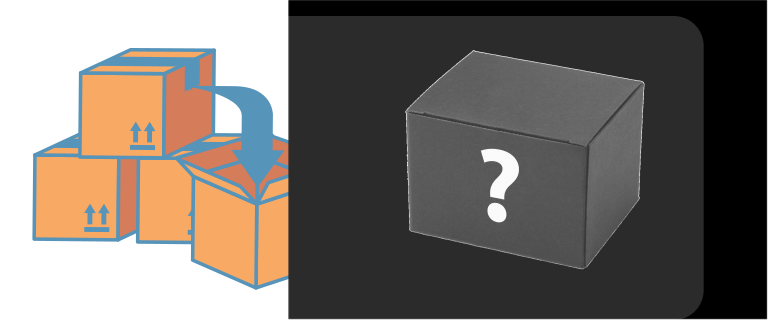
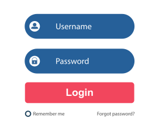
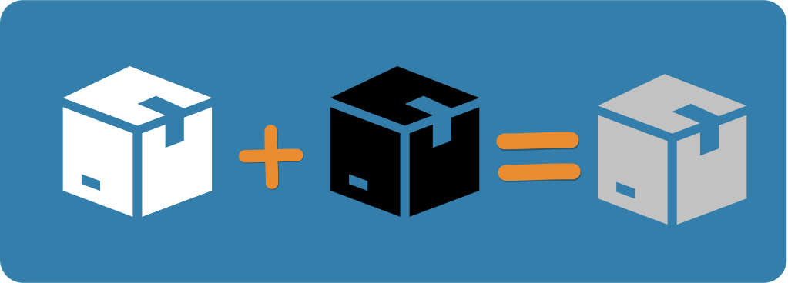

# Khái quát về Software Testing

## Testing

### Testing là gì?

Testing là một hành động kiểm tra tính đúng đắn của một thứ gì đó. Testing luôn xung quanh ta trong cuộc sống hằng ngày.&#x20;

* Làm bài kiểm tra xong, bạn hay kiểm tra lại đáp án rồi mới nộp bài.
* Sau khi thu âm xong, bạn hay nghe lại file thu âm của mình để xem mình có bị vấp hay bị phô chỗ nào không?
* Sau khi nhận bàn giao nhà, trước khi vào ở bạn thường kiểm tra kỹ lưỡng nhà của bạn có xây đúng thiết ban đầu hay không
* Và khi làm xong một sản phẩm phần mềm, người ta hay kiểm tra kỹ phần mềm này để đảm bảo rằng phần mềm hoạt động đúng như thiết kế ban đầu.

### Mục đích của Testing

Không có thứ gì là hoàn hảo. Nhân vô thập toàn và phần mềm cũng vậy.

Mục đích của Testing là phát hiện lỗi sớm trước khi sản phẩm được sử dụng rộng rãi. Lỗi sẽ được fix và re test. Tuy nhiên, không phải lỗi nào cũng sẽ được fix, vì mục đích của Testing không phải là tìm ra và fix tất cả lỗi trong mọi hoàn cảnh (nếu làm được như vậy thì quá siêu nhân rồi).

> Giả sử nhà bạn mở cửa hàng bán bánh mì. Mỗi ổ bánh mì sau khi xuất lò được bạn nghiệm thu rất kỹ và đặc biệt rất thơm ngon. Bất kỳ lỗi nhỏ nào cũng được bạn xử lý một cách trọn vẹn. Tuy nhiên, vào một đêm trời mưa gió bão bùng, kho chứa bột mì nhà bạn lâu ngày cũng đã cũ và vô tình bị thấm nước mưa mà bạn không hề hay biết. Thế là ngày hôm sau bánh mì nhà bạn xuất lò không đạt được chất lượng như ban đầu nữa.&#x20;

Mình biết ví dụ trên nghe có vẻ hơi "ngu ngốc". Tuy nhiên, nó mô tả được vấn đề rằng dù cho chúng ta có kỹ và cẩn thận đến đâu đi chăng nữa thì phần trăm số ít rủi ro vẫn có thể xảy ra. Vì thế, nếu áp dụng Testing với mong muốn tạo ra sản phẩm hoàn hảo là hoàn toàn điên rồ. Thay vì áp đặt mong muốn sản phẩm hoàn hảo thì chúng ta xác định rằng sản phẩm của chúng ta sẽ hoạt động cực kỳ tốt trong một hoàn cảnh nhất định.

## Testing có quan trọng không?

CỰC KỲ QUAN TRỌNG. Bạn làm phần mềm giao dịch tiền gửi ngân hàng mà chức năng gửi tiền ghi nhận số dư bị sai thì thôi nghỉ kinh doanh là vừa.

## Software Testing là gì?

Nói nhiều về Testing rồi, bây giờ chúng ta sẽ nói về Software Testing coi có gi đặc biệt hơn không?

Khi bạn chiên trứng lòng đào thì bạn sẽ kiểm tra những gì? Có phải đó là lòng đỏ trứng có ở trạng thái vừa đặc vừa lỏng không?

Software là phần mềm. Khi làm Software Testing chúng ta sẽ kiểm tra một vài đặc điểm sau:

* Tính năng hoạt động có đúng như thiết kế ban đầu không?
* UI/UX của sản phẩm có thân thiện và dễ sử dụng với người dùng không?
* Khả năng chịu tải của hệ thống khi có số lượng lớn users tăng lên có đảm bảo không?
* Những tính năng này có mang lại nhiều giá trị và đáp ứng nhu cầu phần đông của users không?
* ... blah blah blah, rất nhiều yếu tố khác.&#x20;

Chúng ta sẽ tìm hiểu sâu hơn về các đặc điểm và cách test các đặc điểm ở những chương khác chuyên về kỹ thuật testing.

## Có những loại Software Testing nào?

Có đến hàng trăm loại testing. Tuy nhiên, để đơn giản hóa thì mình sẽ gom nhóm như sau

Có ba loại Testing chính:

* White Box
* Black Box
* Gray Box

Hầu hết mọi người hay chia theo **Manual Testing** và **Automation Testing**. Tuy nhiên, đối với mình thì Manual hay Automation cũng chỉ là những phương tiện thực hiện test khác nhau. Chúng ta sẽ thảo luận sâu hơn về vấn đề này trong bài viết khác.

Ở bài viết này

#### White Box Testing

White Box ở đây được là một cái hộp trong suốt, hay có thể gọi theo một cái tên khác là Glass Box.&#x20;

<figure><figcaption>
White Box - Hộp trong suốt
</figcaption></figure>

Khi nhìn vào một cái hộp trong suốt, chúng ta sẽ thấy tất cả mọi thứ bên trong nó bao gồm Code của tính năng, Code của hệ thống và bao gồm tất cả các logic/process liên quan tới nhau. Nếu bạn không phải là một Developer thì chắc hẳn những kiến thức, khái niệm này sẽ làm bạn bối rối. Đừng lo lắng, bởi vì bạn - một Tester không cần phải am hiểu về những kiến thức này nên **White Box Testing** sẽ không dành cho Tester mà Developer sẽ áp dụng nó trong lúc phát triển phần mềm.

Cuối cùng, chúng ta định nghĩa ngắn ngọn như sau:


White Box Testing là

* Kỹ thuật dùng để test từng dòng code được viết trong phần mềm.
* Được thực hiện bởi Developer.


#### Black Box Testing

Đây là sẽ kỹ thuật mà chúng ta sẽ áp dụng trong suốt sự nghiệp của một Test Engineer.

Black Box là cái hộp mà khi chúng ta nhìn vào nó, chúng ta sẽ chỉ thấy được cái vỏ hộp mà không thấy được bên trong hộp này chứa những vật gì.

<figure><figcaption>
Black Box - Hộp kín
</figcaption></figure>

Black Box Testing là một kỹ thuật test mà lúc test chúng ta không quan tâm Developer đã viết code gì bên trong đó, xử lý logic ra sao mà chỉ quan tâm vào **INPUT** (Đầu vào - Các tham số) và **OUTPUT** (Đầu Ra - Kết quả mong đợi).

Giả sử bạn được giao test chức năng Login của trên website khi user nhập User Name và Password.&#x20;

<figure><figcaption>
Login Form - Form đăng nhập
</figcaption></figure>

Đây là những điều bạn quan tâm

**INPUT**: Username, Password

**OUTPUT**: Website hiển thị dòng thông báo "Bạn đã đăng nhập thành công" và điều hướng về Home Page

Khi bạn test, bạn nhập Input là Username và Password vào Login Form và ấn nút Login. Nếu kết quả sau khi ấn nút Login giống với Output bên trên.

Cuối cùng, định nghĩa ngắn gọn như sau


Black Box Testing là

* Kỹ thuật dùng để test các tính năng (Functionalities) của phần mềm.
* Được thực hiện bởi Tester.


#### Gray Box Testing

Gray Box Testing chỉ đơn giản là sự kết hợp giữa White Box Testing và Black Box Testing.

<figure><figcaption>
Gray Box
</figcaption></figure>

Câu hỏi đặt ra là: Ai sẽ là người thực hiện Gray Box Testing? Developer hay Tester?

Chuyện tình tay ba mập mờ bắt đầu từ đây. Trắng đen không phân biệt rạch ròi thì làm sao mà biết ai làm việc gì đúng không? Thực ra, người thực hiện Gray Box Testing là người biết đọc code theo White Box để thiết kế Test Cases (sẽ có bài viết về Test Case), rồi sau đó thực hiện test theo Black Box.
