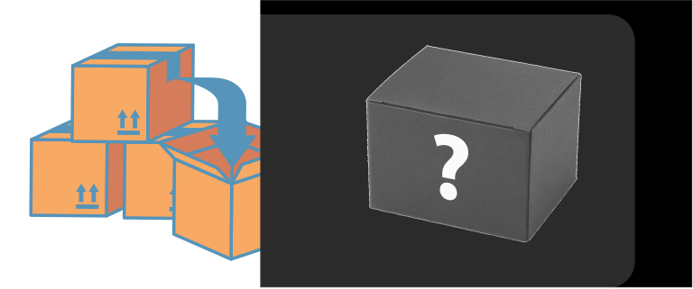

# Phân loại Software Testing

## Có những loại Software Testing nào?

Có đến hàng trăm loại testing. Tuy nhiên, để đơn giản hóa thì mình sẽ gom nhóm như sau

Có ba loại Testing chính:

* White Box
* Black Box
* Gray Box

Hầu hết mọi người hay chia theo **Manual Testing** và **Automation Testing**. Tuy nhiên, đối với mình thì Manual hay Automation cũng chỉ là những phương tiện thực hiện test khác nhau. Chúng ta sẽ thảo luận sâu hơn về vấn đề này trong bài viết khác.

Ở bài viết này

#### White Box Testing

White Box ở đây được là một cái hộp trong suốt, hay có thể gọi theo một cái tên khác là Glass Box.&#x20;

<figure><figcaption>
White Box - Hộp trong suốt
</figcaption></figure>

Khi nhìn vào một cái hộp trong suốt, chúng ta sẽ thấy tất cả mọi thứ bên trong nó bao gồm Code của tính năng, Code của hệ thống và bao gồm tất cả các logic/process liên quan tới nhau. Nếu bạn không phải là một Developer thì chắc hẳn những kiến thức, khái niệm này sẽ làm bạn bối rối. Đừng lo lắng, bởi vì bạn - một Tester không cần phải am hiểu về những kiến thức này nên **White Box Testing** sẽ không dành cho Tester mà Developer sẽ áp dụng nó trong lúc phát triển phần mềm.

Cuối cùng, chúng ta định nghĩa ngắn ngọn như sau:


White Box Testing là

* Kỹ thuật dùng để test từng dòng code được viết trong phần mềm.
* Được thực hiện bởi Developer.


#### Black Box Testing

Đây là sẽ kỹ thuật mà chúng ta sẽ áp dụng trong suốt sự nghiệp của một Test Engineer.

Black Box là cái hộp mà khi chúng ta nhìn vào nó, chúng ta sẽ chỉ thấy được cái vỏ hộp mà không thấy được bên trong hộp này chứa những vật gì.

<figure><figcaption>
Black Box - Hộp kín
</figcaption></figure>

Black Box Testing là một kỹ thuật test mà lúc test chúng ta không quan tâm Developer đã viết code gì bên trong đó, xử lý logic ra sao mà chỉ quan tâm vào **INPUT** (Đầu vào - Các tham số) và **OUTPUT** (Đầu Ra - Kết quả mong đợi).

Giả sử bạn được giao test chức năng Login của trên website khi user nhập User Name và Password.&#x20;

<figure><figcaption>
Login Form - Form đăng nhập
</figcaption></figure>

Đây là những điều bạn quan tâm

**INPUT**: Username, Password

**OUTPUT**: Website hiển thị dòng thông báo "Bạn đã đăng nhập thành công" và điều hướng về Home Page

Khi bạn test, bạn nhập Input là Username và Password vào Login Form và ấn nút Login. Nếu kết quả sau khi ấn nút Login giống với Output bên trên.

Cuối cùng, định nghĩa ngắn gọn như sau


Black Box Testing là

* Kỹ thuật dùng để test các tính năng (Functionalities) của phần mềm.
* Được thực hiện bởi Tester.


#### Gray Box Testing

Gray Box Testing chỉ đơn giản là sự kết hợp giữa White Box Testing và Black Box Testing.

<figure><figcaption>
Gray Box
</figcaption></figure>

Câu hỏi đặt ra là: Ai sẽ là người thực hiện Gray Box Testing? Developer hay Tester?

Chuyện tình tay ba mập mờ bắt đầu từ đây. Trắng đen không phân biệt rạch ròi thì làm sao mà biết ai làm việc gì đúng không? Thực ra, người thực hiện Gray Box Testing là người biết đọc code theo White Box để thiết kế Test Cases (sẽ có bài viết về Test Case), rồi sau đó thực hiện test theo Black Box.
