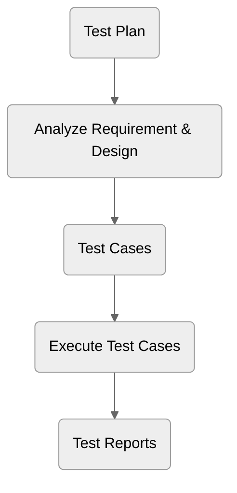

# Làm quen với Test

## Testing là gì?

Testing dịch ra tiếng Việt là "kiểm thử" để kiểm tra một thứ gì đó có hoạt động đúng như yêu cầu ban đầu hay không !

**Ví dụ ngoài đời thực**

**Ngữ cảnh**

Giả sử bạn là một phụ bếp trong nhà hàng 5 sao và đang phục vụ món trứng ốp la tại quầy bếp tại nhà hàng Buffet của khách sạn.&#x20;

**Yêu cầu của món trứng ốp la**

Tiêu chuẩn cho món trứng ốp la như sau:

* Lòng trắng trứng mặt dưới vàng nhẹ
* Lòng trắng trứng chín đều 90%, có màu trắng sữa và không được nổi bong bóng
* Lòng đỏ trứng lòng đào, không quá chín và cũng không quá sống

Sau khi phụ bếp làm xong món trứng thì sẽ kiểm tra lại hết tất cả những tiêu chí trên. Nếu tất cả tiêu chí đã đạt thì món trứng ốp la chính thức đủ tiêu chuẩn phục vụ cho thực khách.

Đó là một ví dụ đơn giản của Testing trong đời thực. Còn trong thế giới phần mềm ra sao? Hãy đọc tiếp bên dưới.

## Tại sao Testing lại quan trọng?

* Làm bài thi tốt nghiệp trung học phổ thông mà không kiểm tra lại bài làm thì có khả năng bài làm bị sai và mất điểm.
* Thông báo kết quả chẩn đoán bệnh của bệnh nhân mà không kiểm tra lại thông tin bệnh nhân thì có khả năng thông báo kết quả bệnh nhân bị ung thư cho bệnh nhân khỏe mạnh.
* Phát triển phần mềm quản lý tài chính cho khách hàng mà không kiểm tra lại việc ghi nhận số dư có hoạt động đúng hay không thì khả năng khách hàng bị mất tiền.

Nhiêu đó cũng đủ để thấy tầm quan trọng của Testing rồi.&#x20;

## Các khái niệm cơ bản

### Black Box Testing

**Black Box Testing** là một trong những loại test mà chúng ta chỉ quan tâm đến INPUT và OUTPUT mà không quan tâm đến LOGIC hay QUY TRÌNH xử lý input và cho ra output.

Ví dụ: Bạn là người kiểm tra xem món trứng anh phụ bếp nhà hàng 5 sao bên trên làm có đúng tiêu chuẩn nhà hàng của bạn hay không? Bạn thực hiện Blackbox Testing

**INPUT**

* 1 quả trứng gà
* 1 cái chảo
* 1 ít dầu ăn
* Bếp

**OUTPUT**

* Lòng trắng trứng mặt dưới vàng nhẹ
* Lòng trắng trứng chín đều 90%, có màu trắng sữa và không được nổi bong bóng
* Lòng đỏ trứng lòng đào, không quá chín và cũng không quá sống

Với Black Box Testing thì bạn không quan tâm đến quy trình anh phụ bếp này đã làm quả trứng ốp la như là: làm nóng chảo và dầu ở nhiệt độ bao nhiêu? Chiên trứng trong bao lâu? vân...vân. Sau khi thành phẩm trứng ốp la được bày ra thì bạn chỉ cần test hết những OUTPUT mà bạn mong đợi. Nếu khớp hết tất cả những tiêu chí trong Output thì coi như Black Box Testing đã đạt.

### White Box Testing

**White Box Testing** là một trong những loại test mà chúng ta không chỉ quan tâm đến INPUT và OUTPUT mà chúng ta cần quan tâm đến QUY TRÌNH hay LOGIC sử dụng INPUT và tạo ra OUTPUT.&#x20;

Trong khi Black Box Testing chỉ kiểm tra INPUT và OUTPUT thì White Box Testing kiểm tra INPUT, OUTPUT và LOGIC của tính năng.&#x20;

Cũng là ví dụ về anh phụ bếp làm quả trứng ốp la. Nếu bạn sử dụng White Box Testing thì bạn phải kiểm tra xem anh phụ bếp có làm nóng chảo đúng cách không? lượng dầu bao nhiêu? nhiệt độ chiên trứng bao nhiêu? Bày trứng ra dĩa như thế nào để đảm bảo lòng đào trứng không bị vỡ? blah blah...

### Unit Testing

Unit Test là loại test kiểm thử tính đúng đắn của một tính năng độc lập với những tính năng khác trong sản phẩm phần mềm

**Ví dụ: Đặt hàng trên Tiki**

&#x20;Bạn đặt hàng trên Tiki thì cần thực hiện những bước sau

* Xem sản phẩm&#x20;
* Chọn sản phẩm vào giỏ hàng
* Thanh toán

Ba bước trên là ba tính năng hoàn toàn riêng biệt không liên quan gì với nhau. Khi Developer  phát triển tính năng **Xem sản phẩm** thì họ sẽ thực hiện Unit Testing cho riêng tính năng **Xem sản phẩm** để đảm bảo tính năng này có hoạt động đúng.&#x20;

### Integration Testing

**Integration Testing** là loại test để kiểm thử tính đúng đắn khi một vài tính năng kết hợp với nhau.

Với ví dụ Đặt hàng trên Tiki bên trên. Nếu Unit Testing chỉ dừng lại khi một trong những tính năng như Xem sản phầm, Chọn sản phẩm vào giỏ hàng hoặc thanh đoán đã hoạt động đúng, thì Interation Testing không kiểm tra như thế mà nó kiểm tra tính đúng đắn khi ba tính năng trên kết hợp lại với nhau rằng khách hàng có mua đúng sản phẩm và thanh toán đúng cho sản phẩm đã chọn hay không?

### System Testing

Nếu bạn đã hiểu Unit Testing và Integration Testing rồi thì System Testing đơn giản là test toàn bộ hệ thống. Khi thực hiện System Testing đồng nghĩa với việc bạn thực hiện tất cả Integration Testing đang có trong hệ thống. Đơn giản là thế.

## Test Lifecycle

