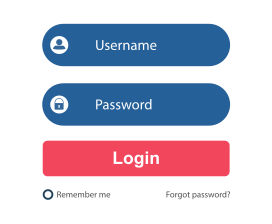
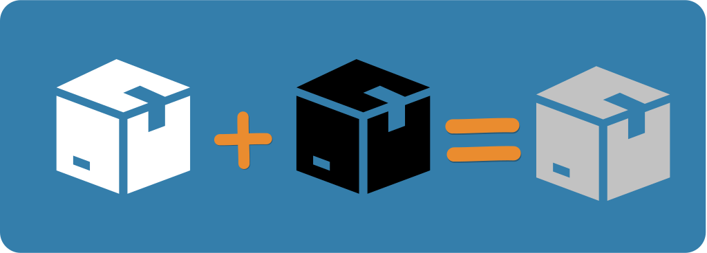

# Những khái niệm cơ bản


Bài viết đang viết dang dở.


## Tản mạn về Testing

### Tầm quan trọng của Testing

:question:Testing có quan trọng không?

Khi bạn tìm đến trang tài liệu này thì chứng tỏ Testing ít nhiều góp phần quan trọng trong công việc của bạn. Đối với tôi, Testing CỰC KỲ QUAN TRỌNG.&#x20;

<figure><figcaption>
Testing cực kỳ quan trọng
</figcaption></figure>

### Ồ, vậy Testing nên hiểu như thế nào?

Theo tôi, Testing chỉ đơn giản là một hành động kiểm tra tính đúng đắn của một thứ gì đó. Testing luôn xung quanh ta trong cuộc sống hằng ngày.&#x20;

* Làm bài kiểm tra xong, bạn hay kiểm tra lại đáp án rồi mới nộp bài.
* Sau khi thu âm xong, bạn hay nghe lại file thu âm của mình để xem mình có bị vấp hay bị phô chỗ nào không?
* Sau khi nhận bàn giao nhà, trước khi vào ở, bạn thường kiểm tra kỹ lưỡng nhà của bạn được xây đúng thiết ban đầu hay không?
* Và khi làm xong một sản phẩm phần mềm, người ta hay kiểm tra kỹ phần mềm này để đảm bảo rằng phần mềm hoạt động đúng như thiết kế ban đầu.

### Mục đích của Testing

Không có thứ gì là hoàn hảo. Nhân vô thập toàn và phần mềm cũng vậy.

Mục đích của Testing là phát hiện lỗi sớm trước khi sản phẩm được sử dụng rộng rãi. Lỗi sẽ được fix và re test. Tuy nhiên, không phải lỗi nào cũng sẽ được fix, vì mục đích của Testing không phải là tìm ra và fix tất cả lỗi trong mọi hoàn cảnh (nếu làm được như vậy thì quá siêu nhân rồi).

> Giả sử nhà bạn mở cửa hàng bán bánh mì. Mỗi ổ bánh mì sau khi xuất lò được bạn nghiệm thu rất kỹ và đặc biệt rất thơm ngon. Bất kỳ lỗi nhỏ nào cũng được bạn xử lý một cách trọn vẹn. Tuy nhiên, vào một đêm trời mưa gió bão bùng, kho chứa bột mì nhà bạn lâu ngày cũng đã cũ và vô tình bị thấm nước mưa mà bạn không hề hay biết. Thế là ngày hôm sau bánh mì nhà bạn xuất lò không đạt được chất lượng như ban đầu nữa.&#x20;

Mình biết ví dụ trên nghe có vẻ hơi "ngu ngốc". Tuy nhiên, nó mô tả được vấn đề rằng dù cho chúng ta có kỹ và cẩn thận đến đâu đi chăng nữa thì phần trăm số ít rủi ro vẫn có thể xảy ra. Vì thế, nếu áp dụng Testing với mong muốn tạo ra sản phẩm hoàn hảo là hoàn toàn điên rồ. Thay vì áp đặt mong muốn sản phẩm hoàn hảo thì chúng ta xác định rằng sản phẩm của chúng ta sẽ hoạt động cực kỳ tốt trong một hoàn cảnh nhất định.

## Software Testing là gì?

Nói nhiều về Testing rồi, bây giờ chúng ta sẽ nói về một phạm vi cụ thể hơn - Software Testing (Kiểm thử phần mềm), để xem thử Testing trong lĩnh vực phát triển phần mềm có gi đặc biệt hơn không?


Có đôi lúc tôi sẽ dùng từ "Software Testing" hoặc "Kiểm thử phần mềm" để mô tả việc kiểm tra các tính năng trong sản phẩm phần mềm nên các bạn xem 2 thuật ngữ này cùng một nghĩa nhé.


Quay lại câu chuyện của chúng ta.

Khi bạn chiên trứng lòng đào thì bạn sẽ kiểm tra những gì? Có phải đó là lòng đỏ trứng có ở trạng thái vừa đặc vừa lỏng không?

Đối tượng Testing bây giờ là **phần mềm**. Khi làm Software Testing chúng ta sẽ kiểm tra một vài đặc điểm sau:

* Tính năng hoạt động có đúng như thiết kế ban đầu không?
* UI/UX của sản phẩm có thân thiện và dễ sử dụng với người dùng không?
* Khả năng chịu tải của hệ thống khi có số lượng lớn users tăng lên có đảm bảo không?
* Những tính năng này có mang lại nhiều giá trị và đáp ứng nhu cầu phần đông của users không?
* ... blah blah blah, rất nhiều yếu tố khác.&#x20;

## Bàn một chút về quy trình

Có hai loại quy&#x20;

## Có những loại Software Testing nào?

### Manual Testing

#### Định nghĩa

Là một HÌNH THỨC KIỂM THỬ thủ công không dùng bất cứ công cụ tự động nào.

#### Người thực hiện

* Test Engineer.
* End Users.

#### Lợi ích

* Kiểm tra các trường hợp một cách chi tiết.
* Linh động trong quá trình kiểm thử khi tính năng thay đổi liên tục.

#### Hạn chế

* Mất nhiều thời gian và công sức thực hiện kiểm thử lại toàn bộ hệ thống.

#### Sử dụng khi nào?

* Kiểm tra sản phẩm mới.
* Kiểm tra những tính năng phức tạp.
* Kiểm tra những tính năng hay có sự thay đổi.

### Automation Testing

#### Khái niệm

Là HÌNH THỨC KIỂM THỬ dùng script hoặc công cụ kiểm thử tự động

#### Người thực hiện

* Test Engineer
* Developer có kinh nghiệm kiểm thử tự động

#### Lợi ích

* Tiết kiệm thời gian và công sức khi thực hiện các tính năng ít thay đổi

#### Hạn chế

* Yêu cầu kiến thức về lập trình.
* Khó kiểm thử cho những tính năng thay đổi thường xuyên.&#x20;

#### Sử dụng khi nào?

* Dùng để test những tính năng ít có sự thay đổi

### White Box Testing

#### Khái niệm

là KỸ THUẬT KIỂM THỬ nhằm kiểm tra cách thức hoạt động bên trong phần mềm thông qua Structure và Business Logic được viết bên trong source code của phần mềm.

#### Người thực hiện

* Test Engineer
* Developer

#### Lợi ích

* Phát hiện lỗi Logic bên trong phần mềm mà bên ngoài không thể test được thấy được

#### Hạn chế

* Yêu cầu phải hiểu về source code của phần mềm.
* Không thể thử nghiệm các case thực tế.

#### Sử dụng khi nào?

* Kiểm tra tính đúng đắn của Business Logic bên trong phần mềm thông qua viết Unit Test và Integration Test.

### Black Box Testing

#### Khái niệm

là KỸ THUẬT KIỂM THỬ phần mềm nhằm tập trung kiểm thử tính đúng đắn của tính năng mà không quan tâm đến cách thức hoạt động bên trong phần mềm.

#### Người thực hiện

* Test Engineer
* End User

#### Lợi ích

* Tập trung vào trải nghiệm người dùng
* Phát hiện lỗi từ góc nhìn của End User

#### Hạn chế

* Không thể kiểm tra được tính đúng đắn của Logic bên trong phần mềm. Đôi lúc Logic bên trong phần mềm hoạt động sai nhưng tính năng bên ngoài lại trả kết quả đúng.

#### Sử dụng khi nào?

* Dùng để phát hiện lỗi khi các tính năng trong phần mềm tương tác với nhau.

### Gray Box Testing

#### Khái niệm

là KỸ THUẬT KIỂM THỬ phần mềm kết hợp cả hai khía cạnh của White Box và Black Box

#### Người thực hiện

* Test Engineer
* Developer

#### Lợi ích

* Kiểm tra được tất cả Business Logic bên trong phần mềm và cả về mặt tính năng theo góc độ của người sử dụng phần mềm.

#### Hạn chế

* Cần hiểu biết về lập trình và tính năng của phần mềm

#### Sử dụng khi nào?

* Dùng kiểm tra tích hợp các yêu cầu và đánh giá source code có đáp ứng yêu cầu hay không

### Functional Testing

#### Khái niệm

Là một loại Black Box Testing chỉ xem xét tính đúng đắn của tính năng trong phần mềm.

#### Người thực hiện

* Test Engineer
* End User

#### Lợi ích

* Đảm bảo tính hoàn thiện về mặt tính năng

#### Hạn chế

* Vì chỉ xem xét tính đúng đắn của tính năng nên sẽ không phát hiện được những vấn đề khác liên quan đến hiệu suất hoặc tính bảo mật của hệ thống phần mềm.

#### Sử dụng khi nào?

* Được dùng để phát hiện lỗi trong tính năng.

### Non-Functional Testing

#### Khái niệm

là một loại Black Box Testing chỉ chú trọng đến các thành phần như: Hiệu suất, bảo mật, khả năng phục hồi, Khả năng chịu tải... mà không quan tâm đến tính năng của phầm mềm.

#### Người thực hiện

* Test Engineer
* Developer
* DevOps

#### Lợi ích

* Đảm bảo hiệu suất của phần mềm dưới các điều kiện và môi trường khác nhau

#### Hạn chế

* Đòi hỏi kiến thức sâu về hệ thống, server...

#### Sử dụng khi nào?

* Khi cần kiểm tra về bảo mật, hiệu suất, khả năng chịu tải.

### Unit Testing

#### Khái niệm

Là một loại kiểm thử nhằm kiểm tra các thành phần riêng lẻ trong hệ thống phần mềm.&#x20;

Ở góc nhìn của Developer thì các thành phần riêng lẻ sẽ là các hàm, các method, các class trong source code.&#x20;

Ở góc nhìn của Test Engineer thì các thành phần riêng lẻ sẽ là các Test Case được viết ra sau quá trình phần tích các scenarios.

#### Người thực hiện

* Test Engineer
* Developer

#### Lợi ích

* Dùng để phát hiện lỗi sớm ở giai đoạn Coding

#### Hạn chế

#### Khi nào sử dụng?

### Integration Testing

### System Testing

### Acceptance Testing

Có đến hàng trăm loại testing và được chia theo nhiều hình thức khác nhau. Tuy nhiên, để đơn giản hóa thì mình sẽ gom nhóm như sau

Có ba loại Testing chính:

* White Box
* Black Box
* Gray Box

Hầu hết mọi người hay chia theo **Manual Testing** và **Automation Testing**. Tuy nhiên, đối với mình thì Manual hay Automation cũng chỉ là những phương tiện thực hiện test khác nhau. Chúng ta sẽ thảo luận sâu hơn về vấn đề này trong bài viết khác.

Ở bài viết này

#### White Box Testing

White Box ở đây được là một cái hộp trong suốt, hay có thể gọi theo một cái tên khác là Glass Box.&#x20;

<figure><figcaption>
White Box - Hộp trong suốt
</figcaption></figure>

Khi nhìn vào một cái hộp trong suốt, chúng ta sẽ thấy tất cả mọi thứ bên trong nó bao gồm Code của tính năng, Code của hệ thống và bao gồm tất cả các logic/process liên quan tới nhau. Nếu bạn không phải là một Developer thì chắc hẳn những kiến thức, khái niệm này sẽ làm bạn bối rối. Đừng lo lắng, bởi vì bạn - một Tester không cần phải am hiểu về những kiến thức này nên **White Box Testing** sẽ không dành cho Tester mà Developer sẽ áp dụng nó trong lúc phát triển phần mềm.

Cuối cùng, chúng ta định nghĩa ngắn ngọn như sau:


White Box Testing là

* Kỹ thuật dùng để test từng dòng code được viết trong phần mềm.
* Được thực hiện bởi Developer.


#### Black Box Testing

Đây là sẽ kỹ thuật mà chúng ta sẽ áp dụng trong suốt sự nghiệp của một Test Engineer.

Black Box là cái hộp mà khi chúng ta nhìn vào nó, chúng ta sẽ chỉ thấy được cái vỏ hộp mà không thấy được bên trong hộp này chứa những vật gì.

<figure><figcaption>
Black Box - Hộp kín
</figcaption></figure>

Black Box Testing là một kỹ thuật test mà lúc test chúng ta không quan tâm Developer đã viết code gì bên trong đó, xử lý logic ra sao mà chỉ quan tâm vào **INPUT** (Đầu vào - Các tham số) và **OUTPUT** (Đầu Ra - Kết quả mong đợi).

Giả sử bạn được giao test chức năng Login của trên website khi user nhập User Name và Password.&#x20;

<figure><figcaption>
Login Form - Form đăng nhập
</figcaption></figure>

Đây là những điều bạn quan tâm

**INPUT**: Username, Password

**OUTPUT**: Website hiển thị dòng thông báo "Bạn đã đăng nhập thành công" và điều hướng về Home Page

Khi bạn test, bạn nhập Input là Username và Password vào Login Form và ấn nút Login. Nếu kết quả sau khi ấn nút Login giống với Output bên trên.

Cuối cùng, định nghĩa ngắn gọn như sau


Black Box Testing là

* Kỹ thuật dùng để test các tính năng (Functionalities) của phần mềm.
* Được thực hiện bởi Tester.


#### Gray Box Testing

Gray Box Testing chỉ đơn giản là sự kết hợp giữa White Box Testing và Black Box Testing.

<figure><figcaption>
Gray Box
</figcaption></figure>

Câu hỏi đặt ra là: Ai sẽ là người thực hiện Gray Box Testing? Developer hay Tester?

Chuyện tình tay ba mập mờ bắt đầu từ đây. Trắng đen không phân biệt rạch ròi thì làm sao mà biết ai làm việc gì đúng không? Thực ra, người thực hiện Gray Box Testing là người biết đọc code theo White Box để thiết kế Test Cases (sẽ có bài viết về Test Case), rồi sau đó thực hiện test theo Black Box.
