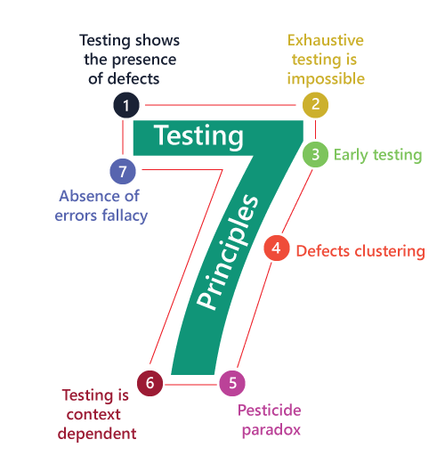

# Những nguyên tắc quan trọng

## Tại sao lại cần đến những nguyên tắc này?

Nguyên tắc tạo nên trật tự và quy luật trong cuộc sống hằng ngày của chúng ta. Nhờ có nguyên tắc mà chúng ta dễ dàng kiểm soát những việc ta làm, điều chỉnh nó và làm cho cuộc sống tươi đẹp hơn.&#x20;

Bạn đang lái xe trên đường thì chắc chắn bạn phải tuân theo luật giao thông. Luật giao thông là tập hợp rất nhiều NGUYÊN TẮC ĐƯỜNG BỘ giúp bạn lái xe an toàn và tìm đường đi một cách dễ dàng hơn.&#x20;

Để làm được một chén nước mắm thơm ngon cho món bánh tráng cuốn thịt luộc thì một nguyên tắc không thể vi phạm là tỏi và ớt phải nổi lên trên đúng không nào.&#x20;

Trong phần mềm, bên phía Developer thì họ phải tuân thủ SOLID Principles thì bên phía Test Engineer, chúng ta phải tuân thủ 7 NGUYÊN TẮC sau

<figure><figcaption>
Software Testing Principles
</figcaption></figure>

* Testing shows the presence of defects
* Exhaustive Testing is not possible: Test toàn diện là bất khả thi.
* Early Testing: Test sớm
* Defect Clustering: Phân cụm lỗi
* Pesticide Paradox: Nghịch lý thuốc trừ sâu
* Testing is context-dependent: Testing luôn phụ thuộc vào ngữ cảnh.
* Absence of errors fallacy: Không có sai lầm ngụy biện

## Testing shows the presence of defects

Nguyên tắc đầu tiên được hiểu như sau:&#x20;

> Testing có thể chỉ ra lỗi nhưng không thể làm thước đo rằng phần mềm không có lỗi dù cho kết quả Testing cho thấy phần mềm không còn lỗi.

Mục đích của việc Test một ứng dụng không phải là tìm ra và fix hết tất cả lỗi mà chỉ GIẢM THIỂU số lỗi tiềm ẩn đang có trong phần mềm. Việc không còn lỗi xuất hiện là không bao giờ có. Một quy tắc bất thành văn, dù cho hoàn thiện đến mức nào đi nữa thì lỗi vẫn luôn xuất hiện.&#x20;

Cuối cùng, nguyên tắc này có thể tóm gọn như sau:

* Kiểm thử là để tìm ra lỗi
* Không còn lỗi không chứng minh được phần mềm sạch
* Mọi kiểm thử đều làm một việc duy nhất là xác nhận tính đúng đắn của tính năng trong điều kiện nhất định.

## Exhaustive Testing is not possible

Nguyên tắc thứ hai được hiểu như sau

> Kiểm thử toàn diện (tất cả cases) là điều bất khả thi.

Dù cho chúng ta có toàn năng cách mấy thì vẫn không thể nào kiểm soát được thế giới. Mượn sự kiện Mông Cổ đã từng xâm chiếm gần như cả thế giới nhưng không thể chiếm được Việt Nam. Dù cho chúng ta có hoàn hảo đến mấy thì vẫn có điểm yếu. Vì thế, dù cho chúng&#x20;

