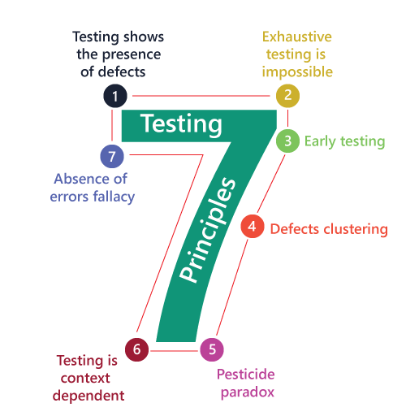
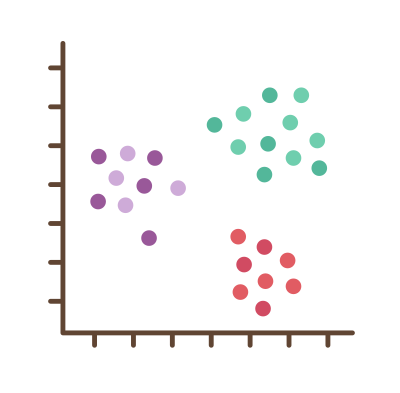

# Những nguyên tắc vàng trong làng Testing

## Tại sao lại cần đến những nguyên tắc này?

Bạn đã đi làm được nhiều năm và cảm nhận thấy rằng, sao mà Test mãi vẫn không lên trình hoặc chỉ lên được một chút. Câu trả lời thật ra rất đơn giản vì bạn không có Kim Chỉ Nam trong sự nghiệp Testing của mình. Kim Chi Nam ở đây chính là một bộ Nguyên Tắc Testing (Software Testing Principles).

Nguyên tắc tạo nên trật tự và quy luật trong cuộc sống hằng ngày của chúng ta. Nhờ có nguyên tắc mà chúng ta dễ dàng kiểm soát những việc ta làm, điều chỉnh nó và làm cho cuộc sống tươi đẹp hơn.&#x20;

Bạn đang lái xe trên đường thì chắc chắn bạn phải tuân theo luật giao thông. Luật giao thông là tập hợp rất nhiều NGUYÊN TẮC ĐƯỜNG BỘ giúp bạn lái xe an toàn và tìm đường đi một cách dễ dàng hơn.&#x20;

Để làm được một chén nước mắm thơm ngon cho món bánh tráng cuốn thịt luộc thì một nguyên tắc không thể vi phạm là tỏi và ớt phải nổi lên trên đúng không nào.&#x20;

Trong phần mềm, bên phía Developer thì họ phải tuân thủ SOLID Principles thì bên phía Test Engineer, chúng ta phải tuân thủ 7 NGUYÊN TẮC sau

## 7 Testing Principles

<figure><figcaption>
Software Testing Principles
</figcaption></figure>

1. Testing shows the presence of defects
2. Exhaustive Testing is not possible
3. Early Testing
4. Defect Clustering
5. Pesticide Paradox
6. Testing is context-dependent
7. Absence of errors fallacy

Chúng ta cùng tìm hiểu từng nguyên tắc  nào!

### 1. Testing shows the presence of defects

Nguyên tắc đầu tiền được hiểu như sau

> Testing có thể chỉ ra lỗi nhưng không thể làm thước đo rằng phần mềm không có lỗi dù cho kết quả Testing cho thấy phần mềm không còn lỗi.

Khi làm phần mềm ai cũng muốn phần mềm của họ chạy tốt, đáng tin cậy. Để đảm bảo điều đó họ thường Testing kỹ phần mềm của họ làm ra. Những khoảng thời gian đầu Testing thì tìm ra rất nhiều Bug, sau đó thì ít dần và bùm 1 ngày nọ họ thấy không còn bug nữa. Họ mừng thầm: "phần mềm của chúng ta đã không còn lỗi nào nữa rồi" (Bug free 100%). Vài tháng sau, đột nhiên họ nhận rất nhiều Bug Report từ phía khách hàng. Phản ứng tự nhiên là họ bị sốc vì họ tự tin rằng phần mềm của họ đã hoàn toàn không còn bug vì kết quả Testing đã cho thấy điều đó. Rồi thế là họ điều tra xem nguyên nhân sinh ra lỗi là gì thì mới phát hiện rằng đã có một trường hợp vừa phát sinh trong nhu cầu sử dụng của khách hàng mà họ chưa lường trước được.&#x20;

<figure><figcaption>
Testing shows the presence of defects
</figcaption></figure>

Mục đích của việc Test một ứng dụng không phải là tìm ra và fix hết tất cả lỗi mà chỉ GIẢM THIỂU số lỗi tiềm ẩn đang có trong phần mềm. Việc không còn lỗi xuất hiện là không bao giờ có. Một quy tắc bất thành văn, dù cho hoàn thiện đến mức nào đi nữa thì lỗi vẫn luôn xuất hiện.&#x20;

Cuối cùng, nguyên tắc này có thể tóm gọn như sau:

* Kiểm thử là để tìm ra lỗi
* Không còn lỗi thì VẪN KHÔNG CHỨNG MINH được phần mềm sạch (Bug free 100%)

### 2. Exhaustive Testing is not possible

Nguyên tắc thứ hai được hiểu như sau

> Kiểm thử toàn diện (tất cả cases và tổ hợp input) là điều bất khả thi. Không thể kiểm tra toàn bộ tính năng trong ứng dụng.

Kiểm thử toàn diện nghĩa là kiểm thử tất cả ngõ ngách trong ứng dụng bao gồm tất cả tính năng, tất cả test cases, integration các tính năng, hiệu suất, bảo mật, khả năng chịu tải... vân vân và mây mây. Việc kiểm tra tất cả như thế cần nhân lực và thời gian rất lớn. Timeline luôn hữu hạn và không đủ để test toàn diện.&#x20;

<figure><figcaption>
Exhaustive Testing is not possible
</figcaption></figure>

Thay vì kiểm thử toàn diện thì phân tích rủi ro (Risk management) và sắp xếp độ ưu tiên (Priority) của tính năng trong các đợt release sẽ mang đến một sản phẩm vừa chất lượng và vừa tiết kiệm công sức.

### 3. Early Testing

> Test càng sớm càng tốt.

Tất cả những hoạt động Testing cần được làm càng sớm càng tốt trong quy trình phát triển phần mềm. Vì khi bắt đầu sớm, chúng ta có thể tìm thấy lỗi sớm hơn. Lúc này, việc fix lỗi sẽ dễ dàng hơn và ít tốn chi phí hơn.&#x20;

<figure><figcaption>
Early Testing
</figcaption></figure>

Nó giống như việc bảo trì xe máy, đi kiểm tra xe máy thường xuyên thì sẽ thấy chỗ nào hư sớm để sửa ngay, nếu để lâu ngày thì các chi tiết khác bên trong máy sẽ bị hư dây chuyền theo làm cho việc sửa xe trở nên phức tạp hơn đồng nghĩa với chi phí sửa chữa tăng lên.

### 4. Defect Clustering

> Sự tập trung của lỗi: Module nào phát hiện có một vài lỗi thì nghĩa là chỗ đó sẽ còn nhiều lỗi tìm ẩn khác.&#x20;

Nguyên tắc này muốn chỉ ra rằng: Lỗi sẽ chỉ nằm tập trung ở một vài module trong ứng dụng chứ không rải rác tất cả module trong ứng dụng.&#x20;

<figure><figcaption>
Defect Clustering
</figcaption></figure>

Trong tiếng anh, lỗi được gọi là Bug. Khi bạn tìm thấy bất kỳ một vài con bug nghĩa là nơi đó rất gần với tổ bug. Vì thế, khi thấy một vài bug trong module A thì có nghĩa là trong module A có thể chứa thêm vài con bug tiềm ẩn.&#x20;

Nguyên tắc này giúp chúng ta dễ phán đoán, định hướng, tiết kiệm công sức khi tìm Bug và Test hiệu quả hơn.

### 5. Pesticide Paradox

Dịch ra là&#x20;

> Hiệu ứng thuốc trừ sâu

Hiệu ứng thuốc trừ sâu ở đây có thể được hiểu là hiệu ứng KHÁNG THUỐC của mấy con bọ trong nông nghiệp. Bọ gây hại nông sản nhưng khi chúng ta sử dụng cùng một loại thuốc trừ sâu nhiều lần, đến một lúc nào đó không còn tác dụng nữa. Bọ đã chính thức lờn thuốc. Trong hoàn cảnh này, chúng ta cần xem xét lại thuốc khác hoặc phương pháp khác để bảo vệ nông sản nhà bạn.&#x20;

<figure><figcaption>
Pesticide Paradox
</figcaption></figure>

Trong phần mềm thì Bug cũng gây hại cho tính năng của ứng dụng. Test Cases giống như các loại thuốc trừ sâu được phát minh bởi chính chúng ta. Ngày qua ngày, chúng ta sử dụng lại bộ Test Cases cũ kĩ đó thì khả năng sẽ chẳng tìm thấy Bug nữa. Nhớ lại nguyên tắc đầu tiên, Testing shows the presence of defects. Nếu ta thỏa mãn khi tất cả test cases mà chúng ta đã làm ra và test phần mềm không còn bug thì chúng ta đã vi phạm nguyên tắc đầu tiên rồi.

Nguyên tắc này nhằm mục đích nhắc nhở ta luôn bảo trì và cập nhật Test Cases.

### 6. Testing is a context-dependent

> Việc kiểm thử phụ thuộc vào bối cảnh (ngữ cảnh)

Bối cảnh/ngữ cảnh được hiểu như thế nào?

Bạn thử tưởng tượng bạn làm Tester cho 2 nhà hàng tên là Bình Dân và Sang Chảnh. Món mì gói 2 nhà hàng này cũng sẽ khác nhau về cách nấu cũng như về chất lượng.&#x20;

<figure><figcaption>
Testing is a context-dependent
</figcaption></figure>

Ở nhà hàng Bình Dân thì món mì gói thì chất lượng ngon rất đơn giản, chỉ cần một gói mì, 2 lát thịt, nước lèo và một vài cọng hành ngò là coi như đạt chuẩn. Để Test cho món mì này thì bạn không cần test quá nhiều về độ ngon và nguyên liệu và chỉ cần test những thành phần đã đầy đủ và ăn có vừa miệng hay chưa.

Ở nhà hàng Sang Chảnh thì món mì gói chất lượng được đặt lên cao hơn. Món mì gói ở nhà hàng này đòi hỏi phải thêm tôm càng xanh, trứng cút, giò heo và một chén nước chấm hảo hạng.  Khi làm Tester cho nhà hàng Sang Chảnh này thì bạn không chỉ test về số lượng đồ ăn đã đầy đủ, mà còn phải test luôn cả hương vị khi các món đồ ăn đó kết hợp với nhau, khi những món đồ ăn đó dùng với nước chấm hảo hạng thì có tạo ra một hương vị ngây ngất làm đắm chìm thực khách, chỉ cần nếm một lần là nhớ mãi.&#x20;

Bạn không thể dùng chuẩn ngon của nhà hàng Sang Chảnh để test cho nhà hàng Bình Dân được và ngược lại. Bạn được đặt vào bối cảnh, môi trường làm việc ở nhà hàng Bình Dân thì bạn phải chấp nhận những giới hạn của nó. Còn bạn được đặt vào bối cảnh, môi trường làm việc ở nhà hàng Sang Chảnh thì phải tuân theo tiêu chuẩn ngày càng cao của họ.

Trong phần mềm, bối cảnh thường thấy nhất là sự khác biệt về loại hình ứng dụng. Test cho ứng dụng thương mại điện tử sẽ chú trọng về quy trình chọn sản phẩm, đặt hàng và thanh toán có tiện dụng cho khách hàng hay không. Trong khi test cho ứng dụng ngân hàng thì sẽ chú trọng nhiều về thông tin nhạy cảm của khách hàng và tính năng phải đảm bảo tài sản của khách hàng lúc nào cũng được bảo vệ một cách an toàn.

### 7. Absence of Errors Fallacy

> Sự sai lầm về kết quả kiểm thử không có lỗi

Đây là một quan điểm sai lầm khi cho rằng kết quả kiểm thử không có lỗi đồng nghĩa với sản phẩm phần mềm không còn lỗi. Sự vắng mặt của lỗi không nói lên được việc sản phẩm phần mềm không còn lỗi.&#x20;

Theo nguyên tắc số 2 thì chúng ta không thể nào kiểm tra tất cả mọi thứ --> Việc một ứng dụng phần mềm không có lỗi là một điều xa xỉ.&#x20;

Thay vì tập trung vào việc làm cho phần mềm không còn lỗi thì trước hết nên ưu tiên phần mềm được tạo ra đáp ứng nhu cầu sử dụng của người dùng, tạo nhiều giá trị và lợi ích cho người dùng nhiều hơn và chỉ cần bug free 99% là đủ.&#x20;

## Tổng kết

Hãy học thuộc và nhớ nằm lòng những nguyên tắc này vì nó sẽ làm kim chỉ nam trong suốt sự nghiệp của một Test Engineer.&#x20;
