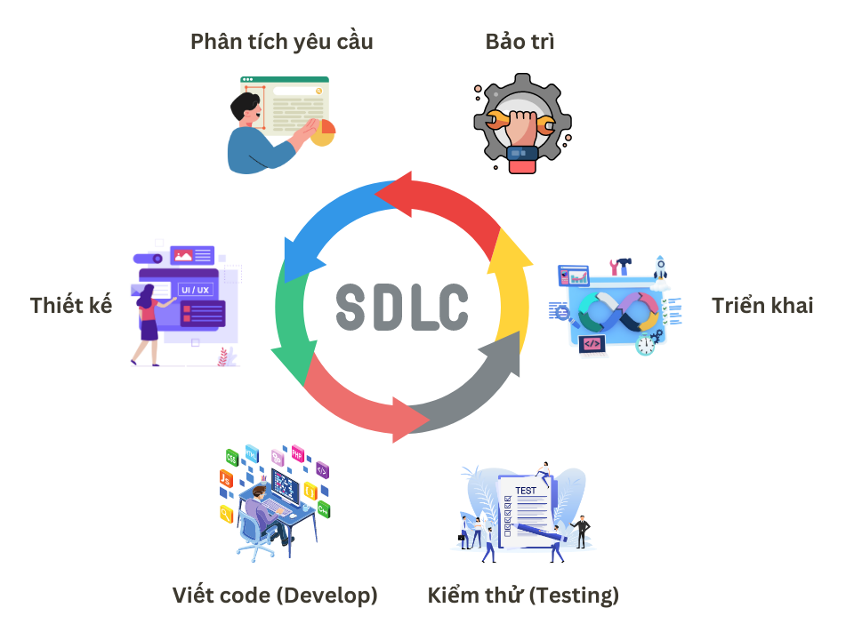
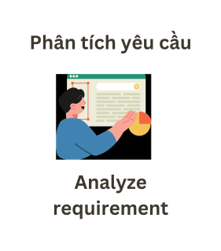
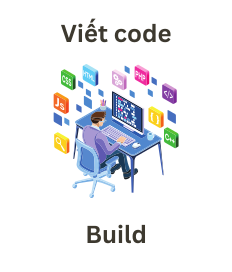
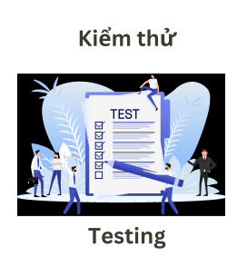
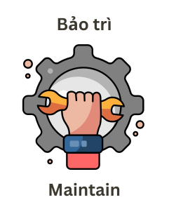

# Software Development Life Cycle (SDLC)

**Software Development Life Cycle** hay viết tắt là **SDLC** là quy trình phát triển phần mềm.&#x20;

Quy trình SDLC này có tổng cộng 6 bước, mỗi bước sẽ làm một nhiệm vụ cụ thể. Trong phát triển phần mềm, người ta sẽ không làm một lần cả trăm tính năng mà sẽ chia ra mỗi giai đoạn làm một vài tính năng. Mỗi giai đoạn thì họ sẽ bắt đầu một quy trình SDLC, sau khi hoàn tất giai đoạn này thì đồng nghĩa một vòng quy trình SDLC cũng kết thúc. Qua giai đoạn tiếp theo, người ta sẽ bắt đầu lại quy trình này và cứ thế lặp đi lặp lại ở mỗi giai đoạn tiếp theo nên người ta mới gọi là Life Cycle (Vòng đời).

Đây là 6 bước trong vòng đời phát triển phần mềm

<figure><figcaption>
Software Development Life Cycle
</figcaption></figure>

1. Phân tích yêu cầu (Analyze Requirement)
2. Thiết kế (Design)
3. Viết code (Build and Develop)
4. Kiểm thử (Testing)
5. Triển khai (Deploy and Deliver)
6. Bảo trì (Maintain)

Bây giờ chúng ta sẽ đi tìm hiểu từng bước trong quy trình này. Mỗi bước sẽ có Input và Output khác nhau. Output của bước này sẽ là Input của bước tiếp theo.

## 1. Phân tích yêu cầu (Analyze Requirement)

Đây là bước khởi đầu và cũng là bước rất quan trọng trong quy trình phát triển phần mềm. Vì mục đích cuối cùng của chúng ta là làm ra sản phẩm có giá trị thực tế và mang lại lợi ích trong công việc hằng ngày của người dùng. Nếu phân tích yêu cầu không được thực hiện tốt thì sản phẩm làm ra có thể không đúng với nhu cầu của người dùng.

<figure><figcaption>
Analyze Requirement - Phân tích yêu cầu
</figcaption></figure>

Ở bước này thì đơn giản chúng ta sẽ thu thập hết tất cả thông tin cần thiết từ khách hàng hoặc nếu chúng ta tự động xây dựng sản phẩm riêng để bán ra thị trường thì cần khảo sát thị trường để thu thập thị hiếu và nhu cầu của người dùng.&#x20;

Những thông tin cơ bản chúng ta cần thu thập như sau

* Nhu cầu và mong đợi của người dùng
* Quy trình nghiệp vụ của ứng dụng
* Ai sẽ là người sử dụng ứng dụng
* Ứng dụng này sẽ phục vụ cho bao nhiêu người
* ... và nhiều yêu cầu khác

Những người trong team phát triển phần mềm có thể là Project Manager (PM), Business Analysist (BA) hoặc Product Owner (PO) hay thậm chí cả Developer và Tester cũng sẽ tham gia vào giai đoạn này để phân tích yêu cầu của sản phẩm.

Sau khi thu thập, phân tích và thảo luận thì đây là những output cơ bản và cần thiết để làm input cho bước tiếp theo.

* Tài liệu mô tả đặc tả yêu cầu của ứng dụng (Software Requirement Specifications)
* Use cases mô tả những tính năng đi kèm
* Flowchart Diagram mô tả quy trình nghiệp vụ của những tính năng
* Sequence Diagram mô tả cách các tính tăng tương tác với nhau trong hệ thống
* Mô tả những rủi ro trong quy trình nghiệp vụ
* ...và một vài thông tin khác tùy vào mức độ chi tiết được yêu cầu từ phía công ty.

## 2. Thiết kế (Design)

<figure><figcaption>
Thiết kế - Design
</figcaption></figure>

Thông qua những thông tin đã được ghi lại trong tài liệu phân tích yêu yều ở bước 1, thì ở bước Thiết kế - Design này sẽ làm những việc như sau:

* Thiết kế hệ thống: Bao gồm cơ sở dữ liệu, kiến trúc phần mềm, các phương thức triển khai...
* Thiết kế giao diện UI/UX
* Thiết kế quy trình làm việc

## 3. Viết code - Build

<figure><figcaption>
Viết code - build
</figcaption></figure>

Gọi là Coding cho gọn chứ thực ra ở bước này thì nhiều việc hơn thế.

* Tester thì bắt đầu biên soạn Test Cases
* Designer tinh chỉnh lại thiết kế cho phù hợp với hệ thống hơn
* Developer thì bắt đầu viết code
* ....

Cơ bản tất tần tận những việc làm nhằm mục đích tạo ra một sản phẩm thật sẽ được làm trong bước này.

## 4. Testing

<figure><figcaption>
Kiểm thử - Testing
</figcaption></figure>

Sau khi build và code xong thì sản phẩm sẽ được đẩy lên môi trường test để cho Tester bắt đầu test những bộ Test Cases đã biên soạn. Kết quả testing sẽ được phản hồi nhanh chóng, nếu Tester phát hiện lỗi trong quá trình testing thì sẽ tạo bug ticket để Developer fix ngay trong bước này. Khi Tester nhận thấy số lượng bug free đã cover đủ chất lượng thì cả team cùng đi qua bước tiếp theo.

## 5. Triển Khai - Deployment

<figure><figcaption>
Triển khai - Deployment
</figcaption></figure>

Triển khai ở đây làm những việc như sau:

* Tạo release note để bắt đầu release sản phẩm. Release sản phẩm có nghĩa là phát hành những tính năng đã làm trong giai đoạn phát triển này.
* Tạo các phiên bản build để deploy lên môi trường Production. Deploy là một hành động để triển khai code trên một môi trường nào đó. Môi trường Production là một môi trường mà ở đó người dùng thật sẽ là người sử dụng sản phẩm.
* Thường các công việc triển khai này sẽ được làm bởi team Devops, những người có chuyên môn cao về lĩnh vực Networking, Server, Security và Infrastructure.
* Sau khi deploy xong lên môi trường Production thì cả team sẽ cùng theo dõi xem có issue nào xảy ra trên môi trường Production hay không? Nếu có thì sẽ fix ngay những issue đó.

## 6. Bảo Trì - Maintain

<figure><figcaption>
Bảo trì - Maintain
</figcaption></figure>

Cuối cùng thì sản phẩm cũng đã bắt đầu chạy trên môi trường thực tế. Để đảm bảo chất lượng thì các công ty có xây dựng sẵn một hệ thống để Monitor (theo dõi) trạng thái của ứng dụng phần mềm để đánh giá

* Có lỗi về mặt tính năng nào nữa không?
* Hiệu suất hoạt động của phần mềm có tốt không?
* Hệ thống chịu tải có tốt không?
* Có lỗ hổng bảo mật nào cần được cải thiện nữa hay không?
* ... Còn nhiều yếu tố khác tùy vào nhu cầu của dự án.

## Tổng kết

Đây là một quy trình SDLC rất cơ bản khi bắt đầu phát triển một sản phẩm phần mềm. Nó giúp cho các hoạt động phát triển phần mềm được theo dõi và kiểm soát chặt chẽ để đảm bảo sản phẩm được tạo ra đảm bảo chất lượng.

